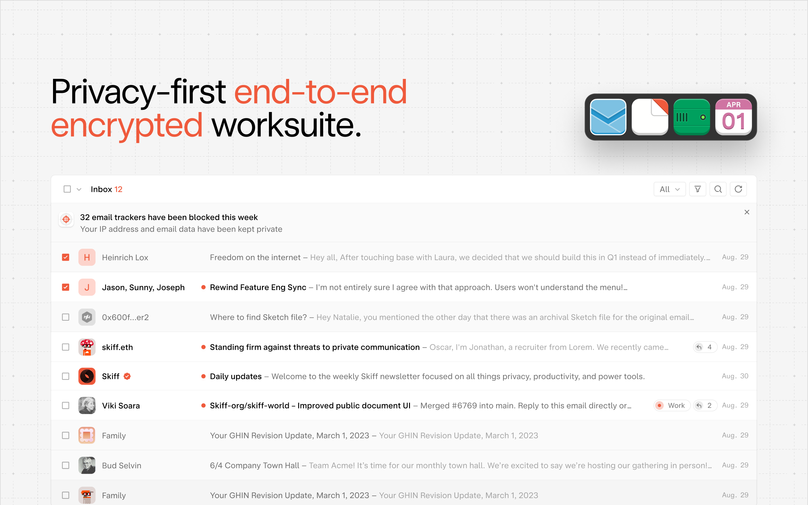

# Skiff hosted content, desktop apps, APKs, and more

This repository stores Skiff's hosted content, including whitepaper.

[Skiff](https://skiff.com) is a privacy-first, end-to-end encrypted workspace with Mail, Calendar, Pages, and Drive products. To visit our repository for open-source products, click [this link](https://github.com/skiff-org/skiff-apps/).

## Windows desktop

Skiff's Windows desktop application, currenly in beta, offers a seamless and secure experience for Windows users. Visit the [Windows](/windows) directory for more.

## Mac desktop

Skiff's Mac desktop enables a seamless and powerful experience directly from your macOS device. Download the app [here](https://apps.apple.com/us/app/skiff-desktop/id1615488683).

## Whitepaper

Skiff's whitepaper covers our security model, how your data is end-to-end encrypted, and how each product works. Visit the [whitepaper](/whitepaper) directory to read further.

## Questions or support

[Contact Us](mailto:support@skiff.org), or join our [Discord](https://discord.com/invite/skiff), [Reddit](https://www.reddit.com/r/skiff), and [Twitter](https://twitter.com/skiffprivacy) communities.

You may also want to check out our [feature request board](https://skiff.canny.io/feature-requests) to discuss potential upcoming features.
